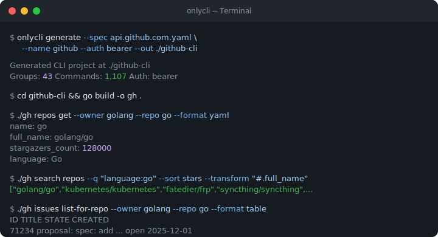

# OnlyCLI

[](https://github.com/onlycli/onlycli/actions/workflows/ci.yml)
[](https://goreportcard.com/report/github.com/onlycli/onlycli)
[](LICENSE)

**Turn any OpenAPI spec into a complete CLI. One command. One binary. 35x fewer tokens than MCP.**

<p align="center">
  
</p>

Every endpoint in the GitHub REST API (1,107 operations) becomes a typed CLI command with flags, help text, and shell completion.

## Install

```bash
go install github.com/onlycli/onlycli/cmd/onlycli@latest
```

Or download a pre-built binary from [Releases](https://github.com/onlycli/onlycli/releases).

## Quick Start

```bash
# 1. Generate -- point at any OpenAPI 3.x spec (local file or URL)
onlycli generate \
  --spec https://raw.githubusercontent.com/swagger-api/swagger-petstore/master/src/main/resources/openapi.yaml \
  --name petstore --out ./petstore-cli

# 2. Build
cd petstore-cli && go mod tidy && go build -o petstore .

# 3. Use
./petstore pet find-pets-by-status --status available --format table
./petstore --help
```

That's it. Every operation in the spec is now a CLI command.

## What You Get

Every generated CLI ships with:

| Capability | How |
|---|---|
| Every endpoint as a command | Grouped by tag, named by operationId |
| All parameters as `--flags` | Path, query, header, and request body fields |
| 7 output formats | `--format json\|yaml\|table\|csv\|pretty\|jsonl\|raw` |
| Field projection | `--transform "#.name"` via [GJSON](https://github.com/tidwall/gjson) |
| Go template output | `--template '{{.login}}'` |
| Auto-pagination | `--page-limit N` auto-detects Link, cursor, offset, page-number |
| Streaming | `--stream` for SSE and NDJSON responses |
| File input | `--data @payload.json` or `--data @-` for stdin |
| OAuth2 authentication | Device flow (interactive) + client credentials (CI) |
| Multi-profile config | `config set staging.token xxx && --profile staging` |
| Retry with backoff | `--max-retries 3` for transient 429/5xx errors |
| Dry-run mode | `--dry-run` prints the request without sending |
| HTTP/2 + gzip | Modern transport, automatic content decompression |
| Shell completion | `completion bash\|zsh\|fish\|powershell` with enum hints |
| Cross-platform | Linux, macOS, Windows; amd64, arm64 |

## Examples

Pre-generated CLIs from live public specs:

| Example | Source Spec | Groups | Commands |
|---|---|---|---|
| [petstore](examples/petstore/) | [Swagger Petstore](https://petstore3.swagger.io/) | 3 | 19 |
| [github](examples/github/) | [GitHub REST API](https://docs.github.com/rest) | 43 | 1,107 |

Regenerate them yourself:

```bash
make generate-example
```

## Comparison

| | OnlyCLI | curl | Restish | MCP tools |
|---|---|---|---|---|
| Typed commands per endpoint | **Yes** | No | Yes | Varies |
| Single distributable binary | **Yes** | Yes | Yes | No |
| Output formatting (table/yaml/csv) | **Yes** | No | No | No |
| Multi-scheme pagination | **Yes** | No | No | No |
| Streaming (SSE/NDJSON) | **Yes** | Manual | No | Varies |
| Works offline, no server process | **Yes** | Yes | Yes | No |
| Token cost for AI agents | **Low** | Low | Low | High |

Detailed write-ups: [vs Stainless](https://onlycli.github.io/OnlyCLI/compare/vs-stainless/) &middot; [vs Restish](https://onlycli.github.io/OnlyCLI/compare/vs-restish/) &middot; [vs curl/HTTPie](https://onlycli.github.io/OnlyCLI/blog/onlycli-vs-curl-httpie/)

## For AI Agents: 35x Cheaper Than MCP

A GitHub MCP server loads **55,000 tokens** into every prompt. Three services consume **72% of your context window** on idle. At scale, that is **$51,000/month** in pure schema overhead.

OnlyCLI takes the opposite approach:

1. Generate a binary once from the spec
2. Agent calls `./cli --help` to discover commands (**~200 tokens**)
3. Agent runs `./cli repos get --owner x --repo y` and reads stdout

Stable command names, predictable flags, structured JSON output. No MCP server, no schema injection, no connection management. [See the full cost analysis](https://onlycli.github.io/OnlyCLI/token-cost/).

## Development

```bash
git clone https://github.com/onlycli/onlycli.git && cd onlycli
make test          # unit + integration tests
make lint          # golangci-lint
make check         # fmt + vet + lint + test
make build         # build to bin/onlycli
```

See [CONTRIBUTING.md](CONTRIBUTING.md) for the full guide and [ARCHITECTURE.md](ARCHITECTURE.md) for codebase structure.

## License

[MIT](LICENSE)
